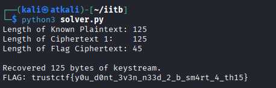

# Writeup: Custom Encryption Challenge

## Category: Cryptography

## Challenge Name:  N00bRandomness

### 1. Challenge Overview

We are provided with a Python script challenge.py and an output file output.txt.

The script implements a custom stream cipher based on a Linear Congruential Generator (LCG). It generates a keystream and XORs it with the plaintext to produce the ciphertext.

The output.txt file gives us:

PLAIN1_HEX: A known plaintext message.

CIPH1_HEX: The encrypted version of the known plaintext.

CIPH2_HEX: Another encrypted message (irrelevant for the solution).

CIPH3_HEX: The encrypted flag.

Objective: Decrypt CIPH3_HEX to retrieve the flag.

### 2. Code Analysis & Vulnerability

The Encryption Logic

The core encryption logic is found in the _mask_bytes function:

```
def _mask_bytes(payload: bytes, x: int, y: int, seed: int) -> bytes:
    s = seed & 0xFF
    out = bytearray()
    for b in payload:
        s = _step(x, y, s) # Generates next keystream byte
        out.append(b ^ s)  # XORs plaintext with keystream
    return bytes(out)
```

The Vulnerability: Keystream Reuse

The vulnerability lies in how main() calls the encryption function:

```
def main():
    msg1, msg2, flag, A, C, SEED = secret.get_secret_material()

    ct1 = _mask_bytes(msg1, A, C, SEED)
    ct2 = _mask_bytes(msg2, A, C, SEED)
    ct3 = _mask_bytes(flag, A, C, SEED)
```

Notice that _mask_bytes is called three times with the exact same secrets (A, C) and the exact same SEED.

Because the LCG is deterministic and resets its state s to SEED at the beginning of every _mask_bytes call, the exact same keystream is generated for every message.

This is a classic "Many-Time Pad" vulnerability.

$C_1 = P_1 \oplus K$

$C_{flag} = P_{flag} \oplus K$

Since we know $P_1$ (the welcome message) and $C_1$, we can trivially recover the keystream $K$:

$K = P_1 \oplus C_1$

Once we have $K$, we can decrypt the flag:

$P_{flag} = C_{flag} \oplus K$

### 3. Exploitation

I wrote a Python script, solve.py, to automate the XOR operations.

_solve.py_:
```py
PLAIN1_HEX = "57656c636f6d6520746f206d7920756c7472612073656375726520656e6372797074696f6e2073657276696365210a54686973206d6573736167652069732066756c6c79206b6e6f776e20746f20796f752e0a537572656c7920796f752063616e6e6f7420627265616b206d792074686973206369706865722e2e2e0a"
CIPH1_HEX  = "c6956bf53271f6a2dda7bf830cd45eb6b5d25666fea9a047ab1deffbcbc729f381240e99d35c80877b5e962db075816e4969e486804950e158bf4ade6c779b8c24dcab2f3db73d2d1ee67fda5a9492f5f44efd5538fee69ee018f6311044782bdf7e48c25d5ec1c7a8839f63ec343f9288b37705c49c8b378bb6c190cf"
CIPH3_HEX  = "e58272e5297fe7e4d2b1af9b2a901bb4b5ff0430bea29c5cea4babc197fb39d5823d5384c923c7bd7d40ce7ba8"

plain1 = bytes.fromhex(PLAIN1_HEX)
ciph1 = bytes.fromhex(CIPH1_HEX)
ciph3_flag = bytes.fromhex(CIPH3_HEX)

print("Length of Known Plaintext:", len(plain1))
print("Length of Ciphertext 1:   ", len(ciph1))
print("Length of Flag Ciphertext:", len(ciph3_flag))

keystream = []
for p, c in zip(plain1, ciph1):
    keystream.append(p ^ c)

print(f"\nRecovered {len(keystream)} bytes of keystream.")


# Logic: Flag = Flag_Cipher XOR Keystream
flag_bytes = []
for c, k in zip(ciph3_flag, keystream):
    flag_bytes.append(c ^ k)

flag = bytes(flag_bytes).decode('utf-8', errors='ignore')

print(f"FLAG: {flag}")

```


It converts the hex strings from output.txt into bytes.

It XORs PLAIN1 and CIPH1 to recover the Keystream.

It XORs CIPH3 with the recovered Keystream to reveal the flag.

Execution:

python3 solve.py




### 4. Conclusion

The challenge relied on a custom stream cipher that failed to implement a unique nonce or initialization vector (IV) for each encryption. By reusing the same seed for multiple messages, the system became vulnerable to a Known Plaintext Attack, allowing us to recover the keystream and decrypt the flag without needing to crack the underlying LCG parameters.

Flag: trustctf{d0nt_r3us3_k3ystr34ms_lmao}

